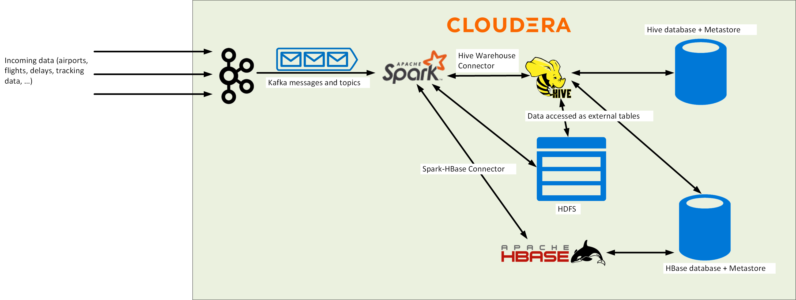

# Overview

In this workshop, you'll learn how to:

- Migrate a Kafka workload from Cloudera to an HDInsight 4.0 Kafka cluster.
- Migrate a Spark workload from Cloudera to an HDInsight 4.0 Spark cluster.
- Migrate a Hive workload and data from Cloudera to an HDInsight 4.0 LLAP cluster.
- Migrate HBase data from Cloudera to an HDInsight 4.0 HBase cluster.

This workshop follows the techniques and strategies described in the document **Migrate your Big Data Workloads to HDInsight**.

# Scenario

Imagine that you work for Contoso, an organization that performs Big Data analytics for the transport industry. The organization is currently engaged in a project that examines the data for commercial airlines, tracking which airlines fly to and from which airports, and analysing the flight times and frequency of flight delays. The data arrives from a number of sources, and includes real-time tracking information provided by the airlines and the various airports. The raw data is captured using Kafka and passed to a number of clients for processing using Spark and Hive. The processed data is stored in an HBase database for subsequent analysis. The current system is based on a Cloudera cluster, running  Hive, Spark, HBase, and Kafka services. The following image shows the high-level architecture of the existing system:

Contoso wish to move operations from Cloudera to HDInsight. However, the system cannot be shutdown while migration occurs, so the transfer must e performed in a manner that allows operations to continue during the switchover, although some temporary degradation in performance is permissible while this occurs.

You will migrate from the Cloudera cluster to four HDInsight clusters, utilizing shared cluster storage and metadata databases. This architecture enables you to decouple and tune each cluster for a specific workload, and allows you to scale the clusters independently. The solution architecture looks like this:

The HBase cluster utilizes its own storage account. The rationale behind this approach is that while Azure Data Lake Gen 2 storage gives the best performance for Hive, Spark, and Kafka clusters, HBase works best with Azure Blob storage.

**Note:** Due to time constraints, in this workshop you will not deploy the clusters using the Enterprise Security Package. In a production system, you must always ensure that your clusters run in a safe and secure environment.