# Exercise 1: Migrate a Kafka workload to HDInsight

## Introduction

In this exercise, you'll migrate a Kafka workload from Cloudera to HDInsight. You'll perform the following tasks:

- Examine the existing Kafka workload running on Cloudera, including the Kafka producer and consumer applications.
- Create the virtual infrastructure for an HDInsight Kafka cluster, and then create the cluster.
- Configure MirrorMaker to replicate topics on the Cloudera cluster to the HDInsight cluster.
- Reconfigure the Kafka consumer application to receive messages from Kafka running on the HDInsight cluster.
- Reconfigure the Kafka producer application to post messages to Kafka running on the HDInsight cluster.

At the end of this process, all incoming data will be received and processed through the Kafka cluster on HDInsight, and the corresponding functionality in the Cloudera cluster can be retired.

## Task 1: Run the existing Kafka workload

The existing Kafka workload receives incoming data about airports, flights, delays, and other tracking information from a variety of sources. The Kafka producer application posts this data to Kafka topics as messages. The Kafka consumer retrieves these messages and processes them so that the data can be analyzed. 

---

**NOTE:**
In the *live* Cloudera system the consumer is a Spark application, but for the purposes of this exercise, you'll run a Scala application that simply retrieves and displays the messages from the Kafka topics. Additionally, in this exercise, the Kafka producer simulates receiving data by reading it from a CSV file.

---


1.On your desktop, open a **Command Prompt** window and sign in to the Cloudera virtual machine. Sign in as **azureuser** with the password you specified when you set up the Cloudera virtual machine. Replace *\<ip_address\>* with the IP address of the virtual machine.

    ```PowerShell
    ssh azureuser@<ip address>
    ```

1. Create a new Kafka topic named **flights**. The producer capturing the flight data will post messages to this topic. This is only a single node cluster, so set the **replication-factor** to 1. Also, set the number of partitions to 1, to minimize resource utilization for this constrained environment:

    ```bash
    kafka-topics --create \
      --zookeeper onprem:2181 \
      --replication-factor 1 \
      --partitions 1 \
      --topic flights
    ```

1. Move to the **apps/kafka** folder: 

    ```bash
    cd ~/apps/kafka
    ```

    This folder contains two applications:

    1. **EventProducer.jar**, that simulates incoming data from flights and airports (this application reads data from a CSV file rather than receiving events). This app writes messages to the **flights** topic.

    1. **Consumer.jar**, which subscribes to the **flights** topic and displays the contents of the messages it reads.

1. Start the Producer app:

    ```bash
    java -cp EventProducer.jar eventdriver \
      --bootstrap-servers onprem:9092 \
      --sourcefilename 2000.csv \
      --topic flights \
      --partitions 1 > /dev/null &
    ```

    This command runs the Producer app silently in the background. You will receive a warning about the log4j configuration which you can safely ignore.

1. Start the consumer app:

    ```bash
    java -cp Consumer.jar eventconsumer \
      --bootstrap-servers onprem:9092 \
      --topic flights
    ```

    You should see messages similar to the following start to appear. These are the messages posted by the Producer app:

    ```text
    Offset = 352
    Value  = {"eventData":{"timestamp":1604244845680,"dateinfo":{"year":"\"2000\"","month":"\"1\"","dayofmonth":"\"24\"","dayofweek":"\"1\"","deptime":"\"2000\"","crsdeptime":"\"2000\"","arrtime":"\"2000\"","crsarrtime":"\"2000\""},"flightinfo":{"carrier":"\"2000\"","flightnum":"\"2000\"","tailnum":"\"2000\"","elapsedtime":"\"2000\"","crselapsedtime":"\"2000\"","airtime":"\"2000\"","arrdelay":"\"2000\"","depdelay":"\"2000\"","origin":"\"2000\"","dest":"\"2000\"","distance":"\"2000\""},"delayinfo":{"taxiin":"\"2000\"","taxiout":"\"2000\"","cancelled":"\"2000\"","cancellationcode":"\"2000\"","diverted":"\"2000\"","carrierdelay":"\"2000\"","weatherdelay":"\"2000\"","nasdelay":"\"2000\"","securitydelay":"\"2000\"","lateaircraftdelay":"\"2000\""}}}
    Offset = 353
    Value  = {"eventData":{"timestamp":1604244846180,"dateinfo":{"year":"\"2000\"","month":"\"1\"","dayofmonth":"\"3\"","dayofweek":"\"1\"","deptime":"\"2000\"","crsdeptime":"\"2000\"","arrtime":"\"2000\"","crsarrtime":"\"2000\""},"flightinfo":{"carrier":"\"2000\"","flightnum":"\"2000\"","tailnum":"\"2000\"","elapsedtime":"\"2000\"","crselapsedtime":"\"2000\"","airtime":"\"2000\"","arrdelay":"\"2000\"","depdelay":"\"2000\"","origin":"\"2000\"","dest":"\"2000\"","distance":"\"2000\""},"delayinfo":{"taxiin":"\"2000\"","taxiout":"\"2000\"","cancelled":"\"2000\"","cancellationcode":"\"2000\"","diverted":"\"2000\"","carrierdelay":"\"2000\"","weatherdelay":"\"2000\"","nasdelay":"\"2000\"","securitydelay":"\"2000\"","lateaircraftdelay":"\"2000\""}}}
    Offset = 354
    Value  = {"eventData":{"timestamp":1604244846681,"dateinfo":{"year":"\"2000\"","month":"\"1\"","dayofmonth":"\"5\"","dayofweek":"\"3\"","deptime":"\"2000\"","crsdeptime":"\"2000\"","arrtime":"\"2000\"","crsarrtime":"\"2000\""},"flightinfo":{"carrier":"\"2000\"","flightnum":"\"2000\"","tailnum":"\"2000\"","elapsedtime":"\"2000\"","crselapsedtime":"\"2000\"","airtime":"\"2000\"","arrdelay":"\"2000\"","depdelay":"\"2000\"","origin":"\"2000\"","dest":"\"2000\"","distance":"\"2000\""},"delayinfo":{"taxiin":"\"2000\"","taxiout":"\"2000\"","cancelled":"\"2000\"","cancellationcode":"\"2000\"","diverted":"\"2000\"","carrierdelay":"\"2000\"","weatherdelay":"\"2000\"","nasdelay":"\"2000\"","securitydelay":"\"2000\"","lateaircraftdelay":"\"2000\""}}}
    ...
    ```

1. Press Ctrl-C to stop the Consumer app.

1. Type the following command to terminate the Producer app:

    ```bash
    kill %1
    ```

1. Leave this command prompt window open.

## Task 2: Create the HDInsight Kafka cluster

In this task, you'll create a new virtual network and subnet to host the cluster.  Then you'll create an Azure Data Lake Gen 2 storage account to be used as the cluster storage for the HDInsight Kafka cluster. Next, you'll add a user-assigned managed identity that HDInsight will use to access the cluster storage. Finally, you'll create the Kafka cluster using this virtual infrastructure.


### Create the virtual network

1. Return to the Azure portal in the web browser.

1. If the Home page isn't currently displayed, click select the **Home** link in the upper left hand corner:

     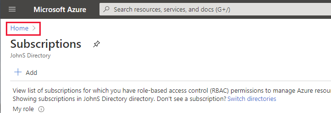

1. On the Azure Home page, select **Create a resource**.

    

1. On the **New** page, in the **Search the Marketplace** box, type **virtual network**, and then select **Virtual Network** from the list that appears:

    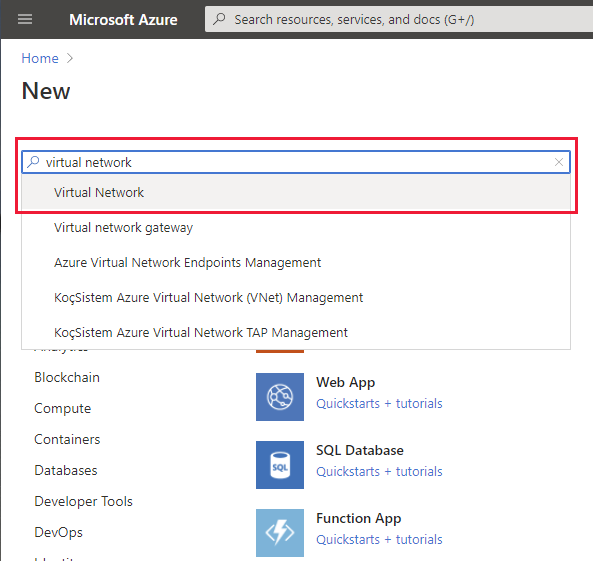

1. On the **Virtual Network** page, select **Create**.

1. On the **Basics** tab of the **Create virtual network** page, enter the following settings, and then select **Next : IP Addresses**:

    > [!NOTE]
    > In this table, replace the **9999** with the suffix that was generated to uniquely identify your resources as part of the lab setup.

    | Field | Value|
    |-|-|
    | Subscription | Select your subscription |
    | Resource group | workshoprg*9999* |
    | Name | clustervnet*9999* |
    | Region | Select the same region used by the Cloudera virtual machine and the workshoprg*9999* resource group |


1. On the **IP Addresses** tab, enter the following settings, and then select **Review + create**:

    | Field | Value|
    |-|-|
    | IPv4 address space | Accept the default address space |
    | Add IPv6 address space | Leave unchecked |
    | Add subnet | Click the **default** subnet. In the **Edit subnet** pane, change the name of the subnet to **clustersubnet**, and then select **Save** |

    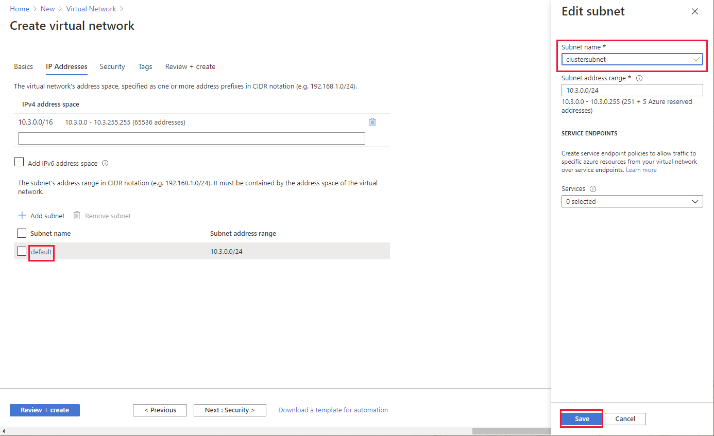

1. On the validation page, select **Create**, and wait while the virtual network is created.

### Create the storage account

1. Go to the Azure Home page and select **Create a resource**.

1. On the **New** page, in the **Search the Marketplace** box, type **storage account**, and then select **Storage account** from the list that appears.

1. On the **Storage account** page, select **Create**.

1. On the **Basics** tab of the **Create storage account** page, enter the following settings, and then select **Next : Networking**:

    | Field | Value|
    |-|-|
    | Subscription | Select your subscription |
    | Resource group | workshoprg*9999*, where *9999* is your unique suffix |
    | Storage account name | clusterstorage*9999* |
    | Location | Select the same region used by the Cloudera virtual machine and the **workshoprg*9999*** resource group |
    | Performance | Standard |
    | Account Kind | StorageV2 (general purpose v2) |
    | Replication | Zone-redundant storage (ZRS) |

1. On the **Networking** tab, accept the default settings, and then select **Next : Data protection**.

1. On the **Data protection** tab, accept the default settings, and then select **Next : Advanced**.

1. On **Advanced** tab, under **Data Lake Storage Gen2**, select **Enabled** for **Hierarchical namespace**. Leave all other settings at their default values, and then select **Review + create**.

1. On the validation page, select **Create**, and wait while the storage account is created.

### Create the user assigned managed identity

1. Go to the the Azure Home page and select **Create a resource**.

1. On the **New** page, in the **Search the Marketplace** box, type **user assigned**, and then select **User Assigned Managed Identity** from the list that appears.

1. On the **User Assigned Managed Identity** page, select **Create**.

1. On the **Basics** tab of the **Create User Assigned Managed Identity** page, enter the following settings, and then select **Review + create**:

    | Field | Value|
    |-|-|
    | Subscription | Select your subscription |
    | Resource group | workshoprg*9999* |
    | Region | Select the same region used by the Cloudera virtual machine and the **workshoprg*9999*** resource group |
    | Name | clustermanagedid |

1. On the validation page, select **Create**, and wait while the user assigned managed identity is created.

1. On the Home page in the Azure portal, under **Recent resources**, select **clusterstorage*9999***.

1. On the **clusterstorage*9999*** page, select **Access Control (IAM)**:

    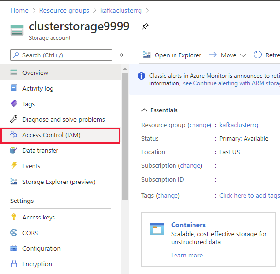

1. On the **clusterstorage*9999* | Access Control (IAM)** page, select **Add**, and then select **Add role assignment**:


    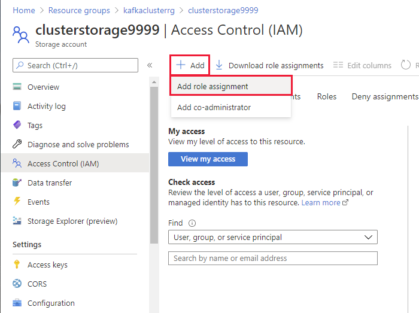

1. In the **Add role assignment** pane, enter the following settings, and then select **Save**:

    | Field | Value|
    |-|-|
    | Role | Storage Blob Data Owner |
    | Assign access to | User assigned managed identity |
    | Subscription | Select your subscription |
    | Select | Specify the clustermanagedid managed identity in the workshoprg*9999* resource group |

1. Wait while the role is assigned, and then click **Role assignments** to verify that it has been assigned successfully:

    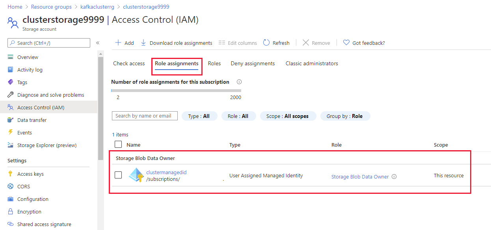

### Create the Kafka cluster

1. Go to the Azure Home page and select **Create a resource**.

1. On the **New** page, in the **Search the Marketplace** box, type **Azure HDInsight**, and then select **Azure HDInsight** from the list that appears.

1. On the **Azure HDInsight** page, select **Create**.

1. On the **Basics** tab of the **Create HDInsight cluster** page, enter the following settings, and then select **Next : Storage**:

    | Field | Value|
    |-|-|
    | Subscription | Select your subscription |
    | Resource group | workshoprg*9999*, where *9999* is your unique suffix |
    | Cluster name | kafkacluster*9999* |
    | Region | Select the same region used by the Cloudera virtual machine and the **workshoprg*9999*** resource group |
    | Cluster type | Kafka |
    | Version | Kafka 2.1.1 (HDI 4.0) |
    | Cluster login name | admin |
    | Cluster login password | Pa55w.rdDemo |
    | Confirm cluster login password | Pa55w.rdDemo |
    | Secure Shell (SSH) username | sshuser |
    | Use cluster login password for SSH | checked |

1. On the **Storage** tab, enter the following settings, and then select **Next : Security + networking**:

    | Field | Value|
    |-|-|
    | Primary storage type | Azure Data Lake Storage Gen2 |
    | Primary storage account | clusterstorage*9999* |
    | Filesystem | cluster*9999* |
    | User-assigned managed identity | clustermanagedid |
    | SQL database for Ambari | leave blank |
    | SQL database for Hive | leave blank |
    | SQL database for Oozie | leave blank |

1. On the **Security + networking** tab, enter the following settings, and then select **Next : Configuration + pricing**

    | Field | Value|
    |-|-|
    | Enable enterprise security package | Leave unchecked |
    | Minimum TLS version | 1.2 |
    | Virtual network | clustervnet*9999*/workshoprg*9999* |
    
    Leave all remaining settings on this tab with their default values.

1. On the **Configuration + pricing** tab, reduce the number of **Worker nodes** to 3 (to save costs for this exercise), and then select **Review + create**.

1. On the validation page, select **Create**, and wait while the cluster is created.

    ---

    **NOTE:** 
    
    This operation may take 15 or 20 minutes to complete

    ---

## Task 3: Configure MirrorMaker to replicate topics

In this task, you'll configure peering between the virtual network containing the Cloudera cluster and the virtual network for the HDInsight Kafka cluster. You'll then use MirrorMaker to replicate Kafka topics from the Cloudera cluster to the HDInsight cluster:

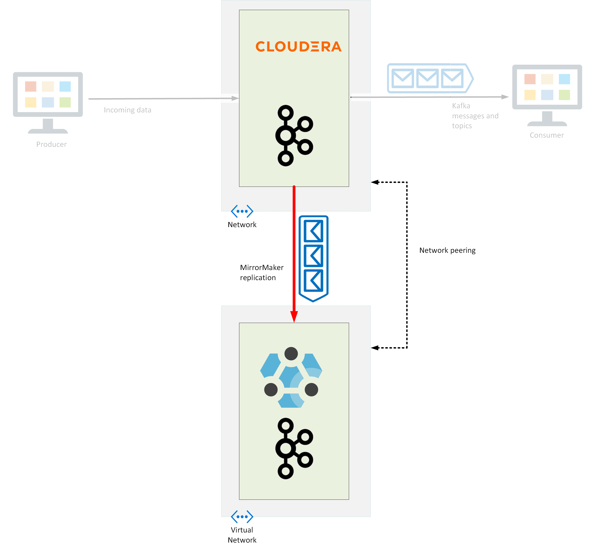

### Peer the virtual networks

1. On the Home page in the Azure portal, under **Recent resources**, select **clustervnet*9999***:

    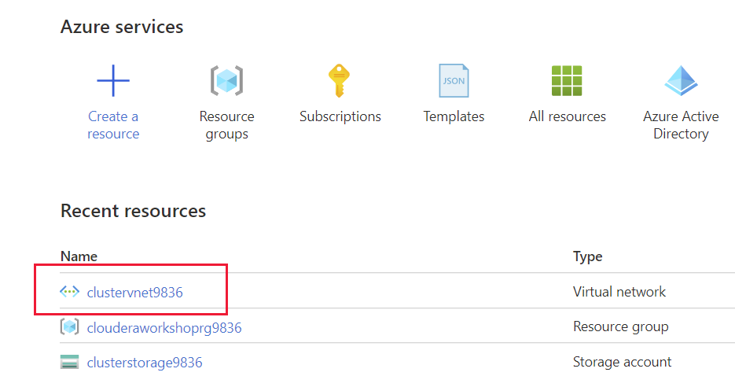

1. On the **clustervnet*9999*** page, under **Settings**, select **Peerings**:

    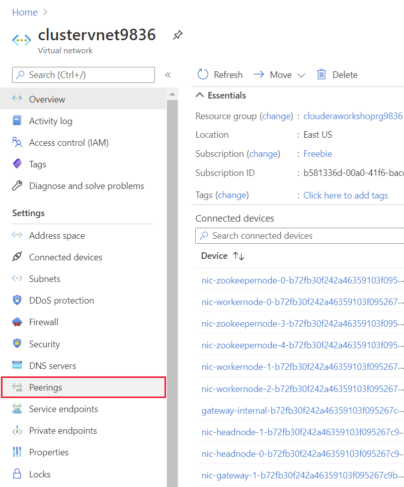

1. On the **clustervnet*9999* | Peerings** page, select **Add**:

    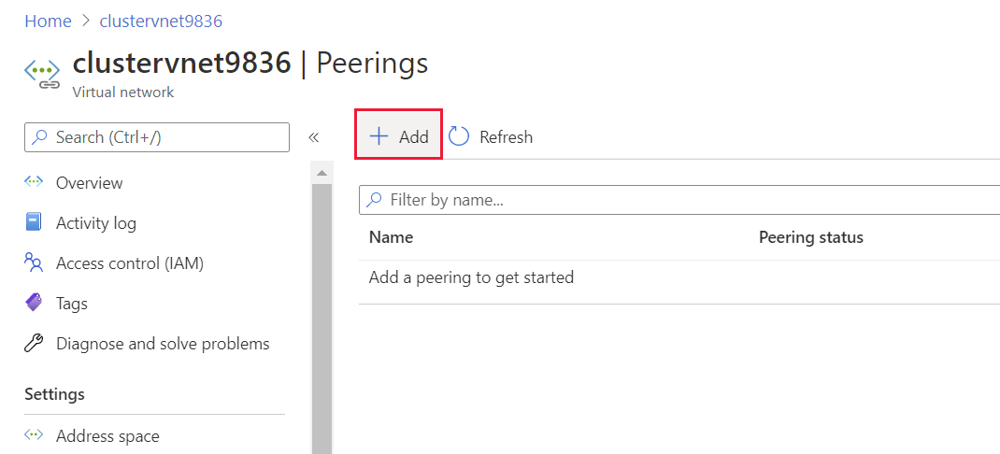

1. On the **Add peering** page, enter the following settings, and then select **Add**:

    | Field | Value|
    |-|-|
    | This virtual network: Peering link name | clustervnet-to-clouderavnet |
    | Traffic to remote virtual network | Allow (default) |
    | Traffic forwarded from remote virtual network | Allow (default) |
    | Virtual network gateway | None (default) |
    | Remote virtual network: Peering link name | clouderavnet-to-clustervnet |
    | Virtual network deployment model | Resource manager |
    | I know my resource ID | Leave unchecked |
    | Subscription | Select your subscription |
    | Virtual network | clouderavmvnet*9999* |
    | Traffic to remote virtual network | Allow (default) |
    | Traffic forwarded from remote virtual network | Allow (default) |
    | Virtual network gateway | None (default) |
    
1. Wait while the network peerings are created.

### Configure the cluster to support MirrorMaker

1. On the Home page in the Azure portal, under **Recent resources**, select **kafkacluster*9999***.

1. On the **Overview** page for the cluster, under **Dashboards**, select **Ambari home**:

    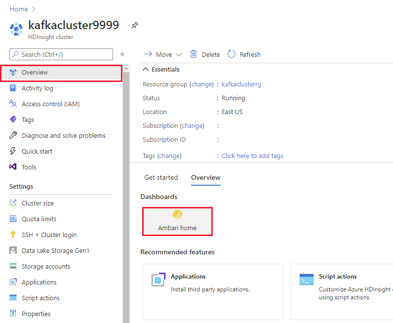

1. Sign in to Ambari as **admin** with password **Pa55w.rdDemo** when prompted. The Ambari page should show that the cluster is running the Zookeeper and Kafka services (amongst others):

    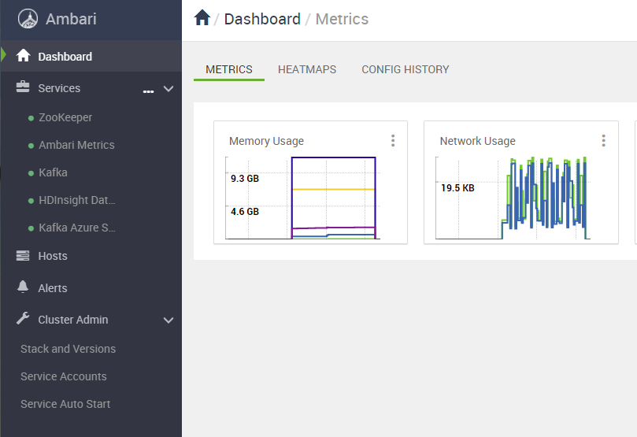


1. In the left-hand pane, select the **Kafka** service. 

1. In the main pane, select **CONFIGS**. In the **Filter** box, type **min.insync.replicas**. Change the value of **min.insync.replicas** to 1, and then select **Save**.

    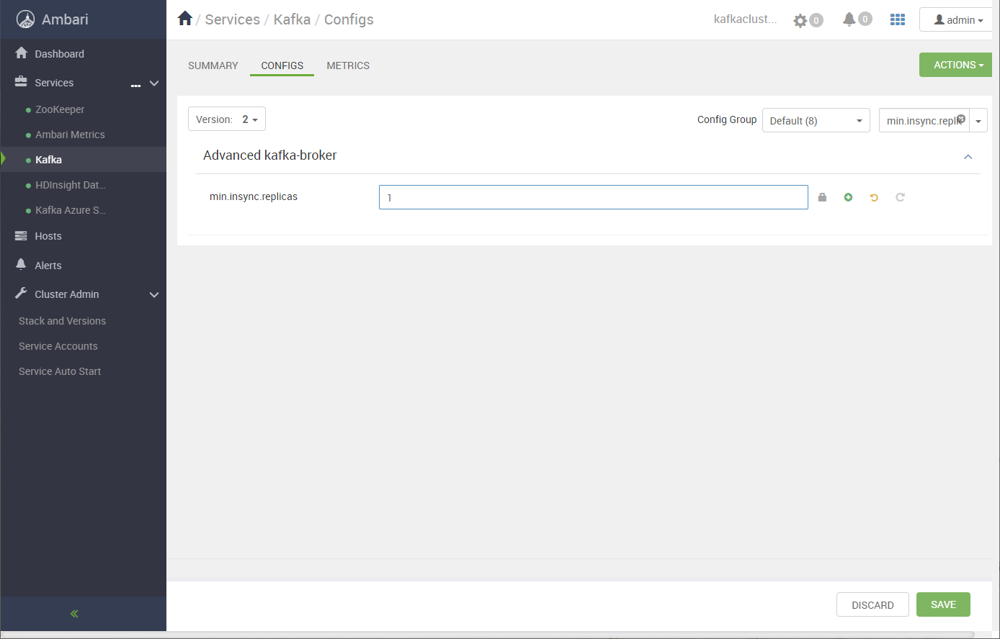

    ---

    **NOTE:** 
    
    This change is necessary due to the reduced number of nodes in the Cloudera cluster.

    ---

1. In the **Save Configuration** dialog box, select **Save** to confirm the change. Select **OK** when the updated has been made.

1. On the configuration page, select **Restart**, and then select **Restart All Affected** to restart the Kafka service with the new configuration. In the **Confirmation** dialog box, select **Confirm Restart All**.

1. In the **Background Operations** dialog box, wait while the service restarts, and then select **OK**.

    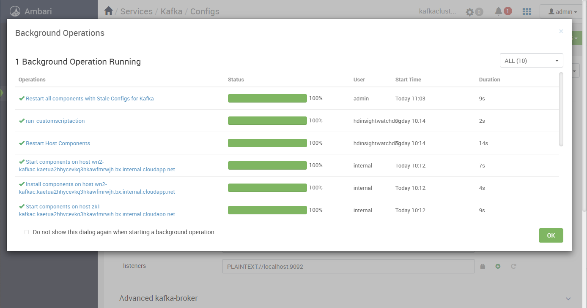

1. In the left-hand pane of the Ambari page, select **Hosts**. Make a note of the name prefixes and IP addresses of the worker nodes with the prefixes **wn*X*** (for example, **wn0**, **wn1**, and **wn2**).

    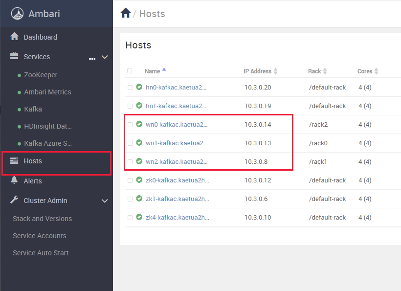

1. Return to the **Command Prompt** window displaying the SSH connection to the Cloudera virtual machine.

1. Run the following command to create a bash shell running as root. Enter your password when prompted.

    ```bash
    sudo bash
    ```

1. Edit the **/etc/hosts** file, and add entries for each of the worker nodes in the HDInsight Kafka cluster to the end of the file. The file below shows an example:

    ---

    **NOTE:** 
    
    Use a text editor of your choice. Editors available for Ubuntu include **vi** and **nano**. The **vi** editor is intended for experienced users, but **nano** is more straightforward to use.

    ---

    ```text
    127.0.0.1 localhost

    # The following lines are desirable for IPv6 capable hosts
    ::1 ip6-localhost ip6-loopback
    fe00::0 ip6-localnet
    ff00::0 ip6-mcastprefix
    ff02::1 ip6-allnodes
    ff02::2 ip6-allrouters
    ff02::3 ip6-allhosts

    10.10.0.4 onprem.internal.cloudapp.net onprem

    # Entries for worker nodes
    10.3.0.14 wn0-kafkac
    10.3.0.13 wn1-kafkac
    10.3.0.8  wn2-kafkac
    ```

1. Run the **ifconfig** command, and make a note of the **inet addr** field for the **eth0** device. This is the private IP address of the Cloudera virtual machine. The text below shows an example of the output generated by the **ifconfig** command. In this example, the **inet addr** is 10.10.0.4.

    ```text
    root@onprem:~/apps/kafka# ifconfig
    eth0    Link encap:Ethernet  HWaddr 00:0d:3a:98:f9:70
            inet addr:10.10.0.4  Bcast:10.10.0.255  Mask:255.255.255.0
            inet6 addr: fe80::20d:3aff:fe98:f970/64 Scope:Link
            UP BROADCAST RUNNING MULTICAST  MTU:1500  Metric:1
            RX packets:45434 errors:0 dropped:15 overruns:0 frame:0
            TX packets:51027 errors:0 dropped:0 overruns:0 carrier:0
            collisions:0 txqueuelen:1000
            RX bytes:21979594 (21.9 MB)  TX bytes:11414674 (11.4 MB)

    lo      Link encap:Local Loopback
            inet addr:127.0.0.1  Mask:255.0.0.0
            ...
    ```

1. Run the following command to quit the root shell and return to the azureuser shell.

    ```bash
    exit
    ```

1. In the Azure portal, on the page for **kafkacluster*9999***, under **Settings**, select **SSH + Cluster login**. In the **SSH + Cluster login** pane, in the **Hostname** list select your cluster, and then make a note of the **ssh** command you can use to connect to this cluster:

    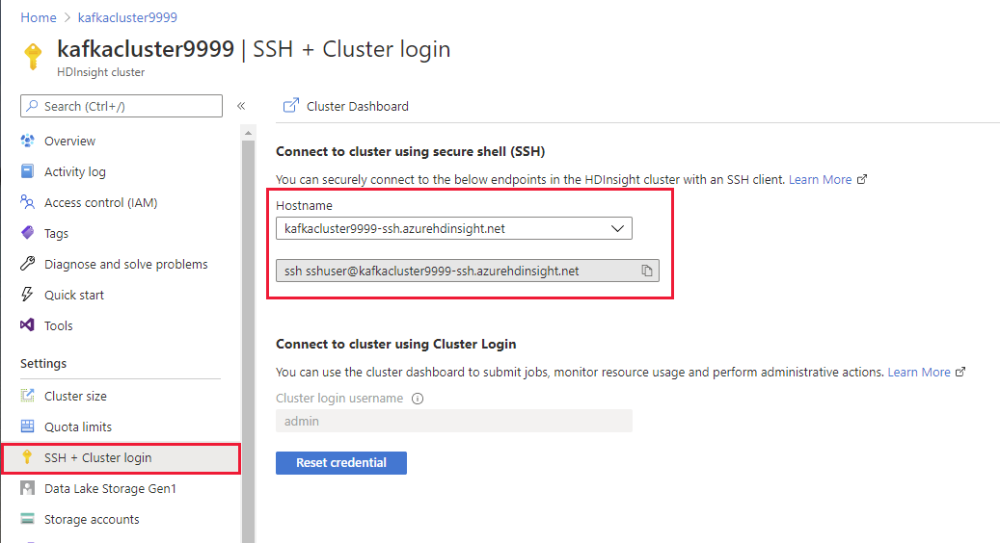

1. On the desktop, open another command prompt window, and run the SSH command you just noted, to sign in to the head node of the Kafka cluster. The password is **Pa55w.rdDemo**:

    ```bash
    ssh sshuser@kafkacluster9999-ssh.azurehdinsight.net
    ```

1. Start a shell running as root:

    ```bash
    sudo bash
    ```

1. Edit the file **/etc/hosts**, and add an entry for the Cloudera virtual machine. The virtual machine has the name **onprem**, with the FQDN of **onprem.internal.cloudapp.net**. The file below shows an example, using the IP address 10.10.0.4 from the earlier step:

    ```text
    127.0.0.1 localhost

    # The following lines are desirable for IPv6 capable hosts
    ::1 ip6-localhost ip6-loopback
    fe00::0 ip6-localnet
    ff00::0 ip6-mcastprefix
    ff02::1 ip6-allnodes
    ff02::2 ip6-allrouters
    ff02::3 ip6-allhosts
    10.3.0.20 hn0-kafkac.kaetua2hhycevkq3hkawfmrwjh.bx.internal.cloudapp.net  headnodehost hn0-kafkac.kaetua2hhycevkq3hkawfmrwjh.bx.internal.cloudapp.net. hn0-kafkac headnodehost. # SlaveNodeManager
    ...
    # Cloudera virtual machine
    10.10.0.4 onprem.internal.cloudapp.net onprem
    ```

1. Run the following command to quit the root shell and return to the sshuser shell.

    ```bash
    exit
    ```

1. Connect to the first worker node (**wn0-kafkac** in the example below). The password is **Pa55w.rdDemo**, as before:

    ```bash
    ssh wn0-kafkac
    ```

1. Start a shell running as root, edit the **/etc/hosts** file, add the entry for the **onprem** virtual machine as before, and then exit the root shell.

1. Disconnect from the wn0-kafkac node, and return to the head node of the cluster.

1. Repeat the previous three steps for the two remaining worker nodes (for example **wn1-kafkac** and **wn2-kafkac**).

    ---

    **NOTE:**
    Under some circumstances, the worker nodes might not be named sequentially. For example, you might find that they are named **wn3-kafkac** and **wn4-kafkac**. Check the entries in the **/etc/hosts** file of the head node for the names of these nodes.

    ---

### Configure MirrorMaker

1. As the **sshuser** on the head node in the Kafka cluster, use an editor to create a file named **consumer.properties**, with the following text:

    ```text
    bootstrap.servers=onprem:9092
    group.id=mirror-group
    auto.offset.reset=latest
    exclude.internal.topics=true
    ```

1. Create another file named **producer.properties** with the following text. Set the **boostrap.servers** property using the names of the worker nodes in your cluster:

    ```text
    bootstrap.servers=wn0-kafkac:9092,wn1-kafkac:9092,wn2-kafkac:9092
    acks=1
    batch.size=100
    ```

1. Run the following command to verify that the **flights** topic in the Cloudera cluster is accessible from the HDInsight Kafka cluster:

    ---

    **NOTE:**

    The path **/usr/hdp/4.1.2.5/kafka/bin/** for the Kafka utilities on the HDInsight cluster was correct at the time of writing, but may change as Microsoft update the implementation of Kafka. Check the contents of the **/usr/hdp** folder for any canges to the folder name for the Kafka utilities.

    ---

    ```bash
    /usr/hdp/4.1.2.5/kafka/bin/kafka-topics.sh --list \
      --zookeeper onprem:2181
    ```

    The results should include the **flights** topic:

    ```text
    __consumer_offsets
    flights
    ```

1. Create a topic on the HDInsight Kafka cluster, also called **flights**:

    ---

    **NOTE:** 
    
    zk0-kafkac is the name of one of the Zookeeper nodes in the kafka cluster. The /etc/hosts file should already contain an entry for this node. It is possible that the Zookeeper nodes are numbered differently, in which case try zk1-kafkac.

    ---

    ```bash
    /usr/hdp/4.1.2.5/kafka/bin/kafka-topics.sh --create \
      --zookeeper zk0-kafkac:2181 \
      --replication-factor 3 \
      --partitions 1 \
      --topic flights
    ```

1. Verify that the local **flights** topic is also available:

    ```bash
    /usr/hdp/4.1.2.5/kafka/bin/kafka-topics.sh --list \
      --zookeeper zk0-kafkac:2181
    ```

1. Start MirrorMaker as a background task:

    ```bash
    /usr/hdp/4.1.2.5/kafka/bin/kafka-mirror-maker.sh \
      --producer.config producer.properties \
      --consumer.config consumer.properties \
      --whitelist flights &
    ```

1. Start the Kafka Console Consumer to listen to the **flights** topic. You'll use this tool to verify that MirrorMaker is configured correctly. The command should block, waiting to receive messages from the topic:

    ```bash
    /usr/hdp/4.1.2.5/kafka/bin/kafka-console-consumer.sh \
      --bootstrap-server wn0-kafkac:9092 \
      --topic flights
    ```

1. Return to the **Command Prompt** window displaying the SSH connection to the Cloudera virtual machine.

1. Run the following command to enable you to post messages to the local **flights** topic.

    ```bash
    kafka-console-producer --broker-list \
      onprem:9092 --topic flights
    ```

1. Enter a few messages, such as "Test 1", "Test 2", and so on. Verify that these messages are replicated and are displayed by the kafka-consumer-console.sh tool on the Kafka cluster head node. Press CTRL-D to finish. 

1. In the command prompt window displaying the SSH connection to the Kafka head node, press CTL-C to stop the consumer.

## Task 4: Reconfigure the Kafka consumer application

In this task, you'll migrate and reconfigure the Kafka consumer application to subscribe to topics in the HDInsight Kafka cluster.


1. Switch back to the SSH session for the Cloudera virtual machine.

1. Move to the **apps/kafka** folder: 

    ```bash
    cd ~/apps/kafka
    ```

1. Start the Producer app in the background:

    ```bash
    java -cp EventProducer.jar eventdriver \
      --bootstrap-servers onprem:9092 \
      --sourcefilename 2000.csv \
      --topic flights \
      --partitions 1 > /dev/null &
    ```

1. Start the consumer app:

    ```bash
    java -cp Consumer.jar eventconsumer \
      --bootstrap-servers onprem:9092 \
      --topic flights
    ```

    You should see messages containing flight data, as before. Leave the app running.

    This application represents the existing client workload.

1. Open a new command prompt window on the desktop, and open another connection to the Cloudera virtual machine:

    ```bash
    ssh azureuser@<ip address>
    ```

1. Move to the **apps/kafka** folder: 

    ```bash
    cd ~/apps/kafka
    ```

1. Run the following command to copy the Consumer application to the head node on the HDInsight Kafka cluster. Replace ***9999*** with the number you used to identify your cluster:

    ```bash
    scp Consumer.jar sshuser@kafkacluster9999-ssh.azurehdinsight.net:~
    ```

1. Close this SSH session.

1. Switch back to the SSH session for the HDInsight Kafka cluster head node.

1. Start the consumer application, but connect it to the **flights** topic in the Kafka cluster:

    ```bash
    java -cp Consumer.jar eventconsumer \
      --bootstrap-servers wn0-kafkac:9092 \
      --topic flights
    ```

    Verify that messages start appearing. You have now migrated the Kafka client app to HDInsight.

1. Return to the SSH session for the Cloudera virtual machine, and press CTRL-C to stop the consumer application.

## Task 5: Reconfigure the Kafka producer application

In this task, you'll update the producer application to post messages to topics in the HDInsight cluster. After this step is complete, you can decommission Kafka in the Cloudera cluster.

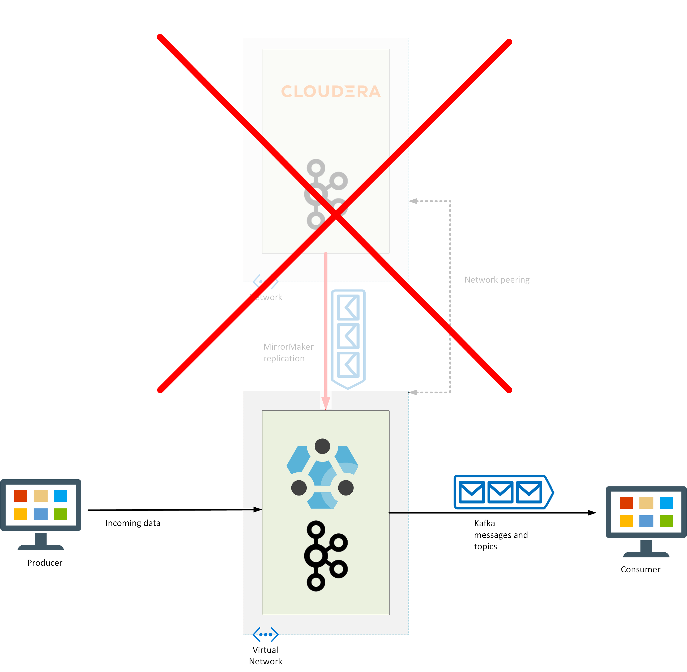

1. In the SSH session on the Cloudera virtual machine, run the following command to copy the Producer application to the head node in the HDInsight Kafka cluster:


    ```bash
    scp EventProducer.jar sshuser@kafkacluster9999-ssh.azurehdinsight.net:~
    ```

1. Copy the data file used as the events source to the HDInsight Kafka cluster:

    ```bash
    scp 2000.csv sshuser@kafkacluster9999-ssh.azurehdinsight.net:~
    ```

1. Open a new command prompt window on the desktop, and open another connection to the head node for the HDInsight Kafka cluster:

    ```bash
    ssh sshuser@kafkacluster9999-ssh.azurehdinsight.net
    ```

1. Start the **EventProducer** application and send messages to the **flights** topic in the Kafka cluster:

    ```bash
    java -cp EventProducer.jar eventdriver \
        --bootstrap-servers wn0-kafkac:9092 \
        --sourcefilename 2000.csv \
        --topic flights --partitions 1
    ```

1. Switch back to the original SSH session for the Cloudera virtual machine.

1. Run the following command to stop the **EventProducer** application:

    ```bash
    kill %1
    ```

    ---

    **You have now migrated the Kafka applications to HDInsight and allowed the service to continue running while you did so.**

    ---

## Task 6: Tidy up

---

**NOTE:** 

Deleting the cluster doesn't delete the storage account or network resources. You can reuse these items for other clusters.

---

1. In SSH session running the **EventProducer** application, press CTRL-C to stop the application, and then run the following command to close the connection to the head node.

    ```bash
    exit
    ```

1. In SSH session running the **Consumer** application, press CTRL-C to stop the application, and then close the connection to the head node.

1. In the Azure portal, go to the page for the HDInsight Kafka cluster.

1. In the command bar, select **Delete**:

    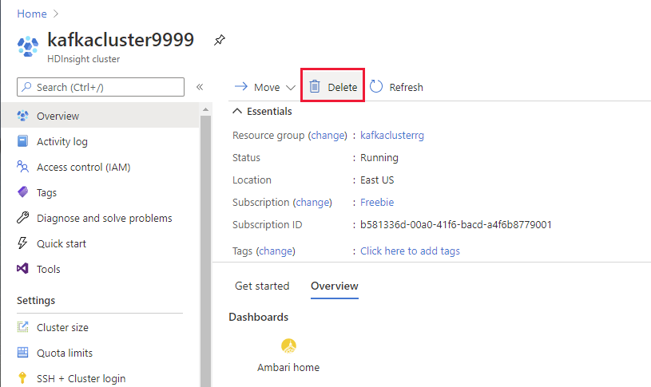

1. In the confirmation pane, enter the name of the cluster, and then select **Delete**.

    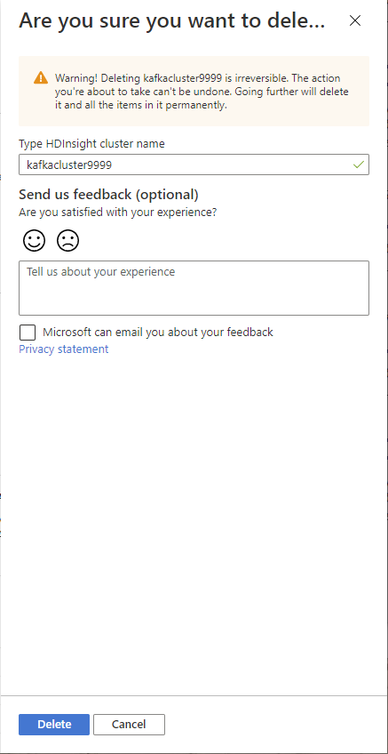

---

**NOTE:** 

If you don't wish to perform any of the other exercises in this lab, you can delete the entire **workshoprg*9999*** resource group.

---

