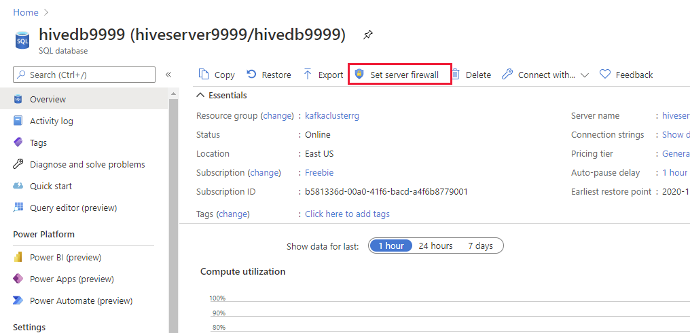
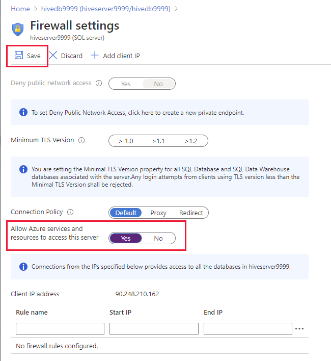

## Create the SQL Database

1. On the Azure Home page, select **Create a resource**.

1. On the **New** page, in the **Search the Marketplace** box, type **SQL Database**, and then press Enter.

1. On the **SQL Database** page, select **Create**.

1. On the **Basics** tab of the **Create SQL Database** page, enter the following settings, and then select **Review + create**:

    | Field | Value|
    |-|-|
    | Subscription | Select your subscription |
    | Resource group | clusterrg |
    | Database name | hivedb*nnnn*, where *nnnn* is the same random four digit number you selected when you created the Kafka cluster (if necessary, you can use a different number, but for consistency try and reuse the same value if possible) |
    | Server | Select **Create new**. In the **New Server** pane, name the server **hiveserver*9999***, set the server admin login name to **azuresa**, provide a password of your choice, and specify the same location that you have used for other resources created during this lab. |
    | Want to use SQL elastic pool | No |
    | Compute + storage | Select **Configure database**. On the **General Purpose** tab, select **Serverless**, and then click **Apply**. |

1. On the **Create SQL Database** page, select **Create**, and wait while the database and server are created.

1. On the Azure Home page, under **Recent resources**, select **hivedb*9999***

1. On the **hivedb*9999*** page, select **Set server firewall**.

    

1. On the **Firewall settings** page, set **Allow Azure services and resources to access this server** to **Yes**, select **Save**, and then select **OK** when the firewall has been updated.

    
