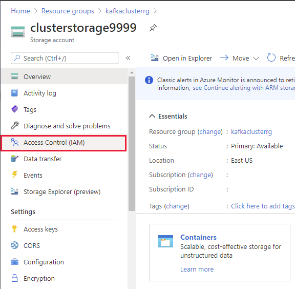
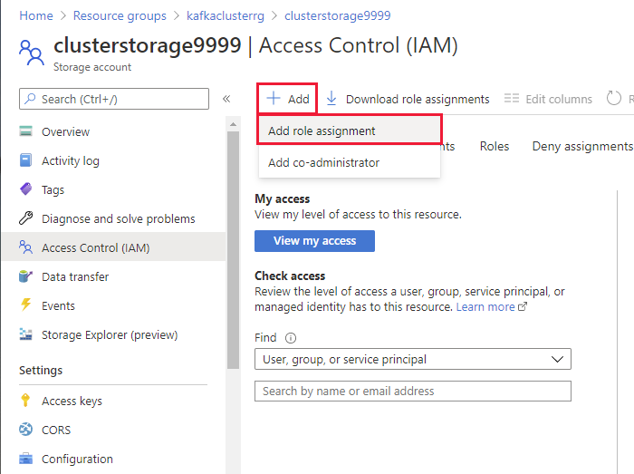
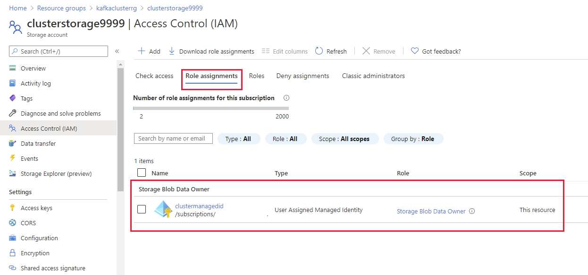

## Create the user assigned managed identity

1. On the Azure Home page, select **Create a resource**.

1. On the **New** page, in the **Search the Marketplace** box, type **user assigned**, and then select **User Assigned Managed Identity** from the list that appears.

1. On the **User Assigned Managed Identity** page, select **Create**.

1. On the **Basics** tab of the **Create User Assigned Managed Identity** page, enter the following settings, and then select **Review + create**:

    | Field | Value|
    |-|-|
    | Subscription | Select your subscription |
    | Resource group | clusterrg |
    | Region | Select the same region used by the Cloudera or MapR virtual machine and the **clusterrg** resource group |
    | Name | clustermanagedid |

1. On the validation page, select **Create**, and wait while the user assigned managed identity is created.

1. On the Home page in the Azure portal, under **Recent resources**, select **clusterstorage*9999***.

1. On the **clusterstorage*9999*** page, select **Access Control (IAM)**:

    

1. On the **clusterstorage*9999* | Access Control (IAM)** page, select **Add**, and then select **Add role assignment**:

    

1. In the **Add role assignment** pane, enter the following settings, and then select **Save**:

    | Field | Value|
    |-|-|
    | Role | Storage Blob Data Owner |
    | Assign access to | User assigned managed identity |
    | Subscription | Select your subscription |
    | Select | clustermanagedid |

1. Wait while the role is assigned, and then click **Role assignments** to verify that it has been assigned successfully:

    
