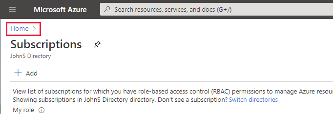
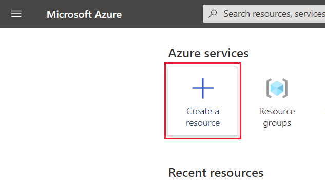
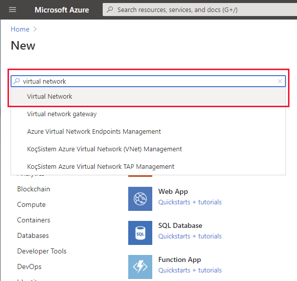
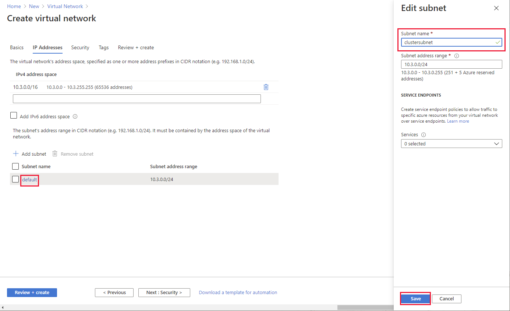

## Create the virtual network

1. Return to the Azure portal in the web browser.

1. If the Home page isn't currently displayed, click select the **Home** link in the upper left hand corner:

     

1. On the Home page, hover over the **Resource groups** icon, and then select **Create**:

    

1. On the **Create a resource group** page,  select the same subscription and region that you used to create the Cloudera virtual machine. Name the resource group **clusterrg**, and then select **Review + create**.

#### Create the virtual network

1. On the validation page, select **Create**, and wait while the resource group is created.

1. On the Azure Home page, select **Create a resource**.

1. On the **New** page, in the **Search the Marketplace** box, type **virtual network**, and then select **Virtual Network** from the list that appears:

    

1. On the **Virtual Network** page, select **Create**.

1. On the **Basics** tab of the **Create virtual network** page, enter the following settings, and then select **Next : IP Addresses**:

    | Field | Value|
    |-|-|
    | Subscription | Select your subscription |
    | Resource group | clusterrg |
    | Name | clustervnet |
    | Region | Select the same region used by the Cloudera virtual machine and the **clusterrg** resource group |

1. On the **IP Addresses** tab, enter the following settings, and then select **Review + create**:

    | Field | Value|
    |-|-|
    | IPv4 address space | Accept the default address space |
    | Add IPv6 address space | Leave unchecked |
    | Add subnet | Click the **default** subnet. In the **Edit subnet** pane, change the name of the subnet to **clustersubnet**, and then select **Save** |

    

1. On the validation page, select **Create**, and wait while the virtual network is created.
