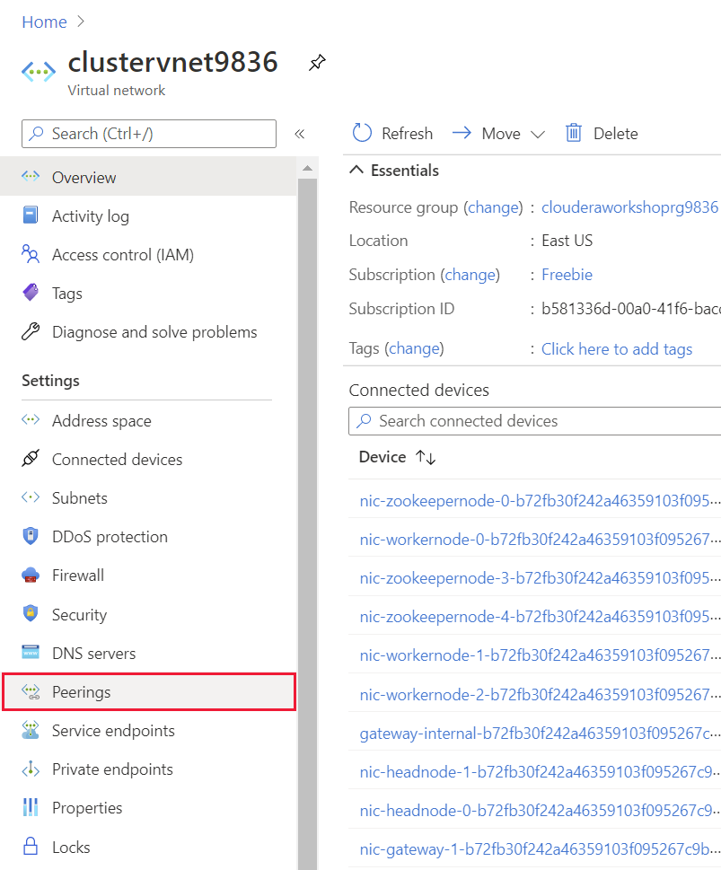
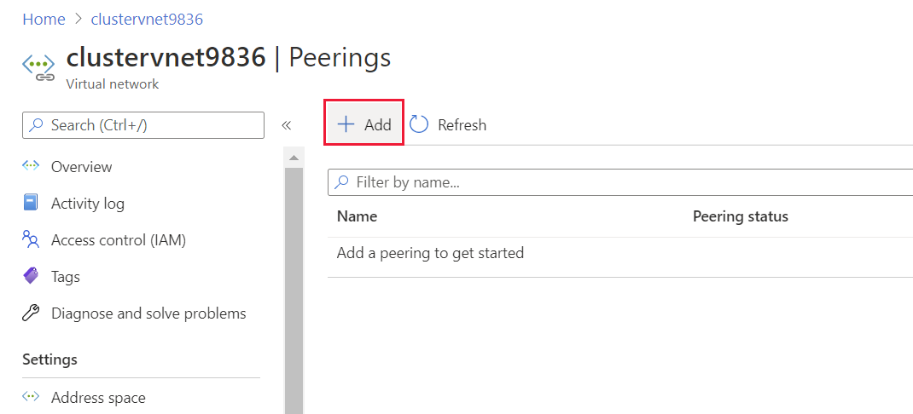

## Peer the virtual networks

1. On the Home page in the Azure portal, select **Resource Groups**, and then select the **workshoprg*9999*** resource group. 

1. On the **workshoprg*9999*** resource group page, select  **clustervnet*9999***:

1. On the **clustervnet*9999*** page, under **Settings**, select **Peerings**:

    

1. On the **clustervnet*9999* | Peerings** page, select **Add**:

    

1. On the **Add peering** page, enter the following settings, and then select **Add**:

    | Field | Value|
    |-|-|
    | This virtual network: Peering link name | clustervnet-to-onpremvnet |
    | Traffic to remote virtual network | Allow (default) |
    | Traffic forwarded from remote virtual network | Allow (default) |
    | Virtual network gateway | None (default) |
    | Remote virtual network: Peering link name | onpremvnet-to-clustervnet |
    | Virtual network deployment model | Resource manager |
    | I know my resource ID | Leave unchecked |
    | Subscription | Select your subscription |
    | Virtual network | clouderavmvnet*9999*  or maprvmvnet*9999* |
    | Traffic to remote virtual network | Allow (default) |
    | Traffic forwarded from remote virtual network | Allow (default) |
    | Virtual network gateway | None (default) |
    
1. Wait while the network peerings are created.